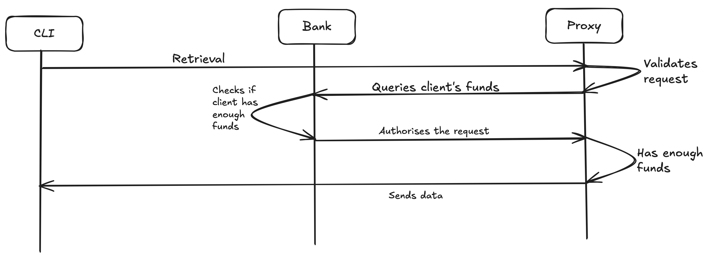

# FIDL 

> Currently in development

## Table of Contents

* [Overview](#overview)
* [CLI (Command Line Interface)](#cli)
* [Service/Bank](#bank)
* [Proxy](#proxy)
* [License](#license)

## Overview

FIDL is an on-going development project consisting in three different components:
* [CLI (Command Line Interface)](#cli): client to deposit FIL funds and request retrievals from storage providers
* [Service/Bank](#bank): http server to act as a service/bank
    * [Migrations](#migrations): postgres database
* [Proxy](#proxy): http server to be installed on storage providers, to bridge the communication between clients and the service/bank

Simple sequential diagram for a retrieval request:


Configuration variables should be configured on `etc/fidl.config`.

## CLI

To run the CLI: `go run cmd/cli/main.go`

## Service/Bank

To run the Bank: `go run cmd/bank/main.go`

HTTP server API featuring the following endpoints:
* POST `/api/v1/register`: registers a proxy on the bank
* POST `/api/v1/deposit`: client deposits FIL funds on the bank
* GET `/api/v1/withdraw`: client withdraws FIL funds from the bank
* POST `/api/v1/balance`: checks client's balance
* POST `/api/v1/authorize`: authorizes transaction
* POST `/api/v1/redeem`: proxy redeems funds of transaction

Example of configuration variables:
```
env="development"

[logger]
level="DEBUG"
bank-path="logs/fidl-bank.log"

[fidl-bank]
address="127.0.0.1"
fqdn="localhost"
listen-port=8080
port=8080
read-timeout=15
write-timeout=15
shutdown-timeout=10
tls=false

[database]
dsn="postgres://user@localhost/fidl-bank-development?sslmode=disable"
max-open-connections=25
max-idle-connections=25
max-idle-time="15m"
```

### Migrations

Migrations are managed by [go-migrate](https://github.com/golang-migrate/migrate#cli-usage)

To run migrations:
`migrate -path=./postgres/migrations -database=$DSN up`

-   `$DSN` should contain your database data source string

## Proxy

To run the Proxy: `go run cmd/proxy/main.go`

Example of configuration variables:
```
env="development"

[logger]
level="DEBUG"
proxy-path="logs/fidl-proxy.log"

[fidl-proxy]
address="127.0.0.1"
fqdn="localhost"
listen-port=4000
port=4000
read-timeout=15
write-timeout=15
shutdown-timeout=10
tls=false
```